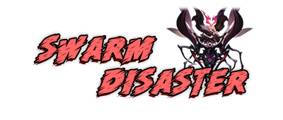
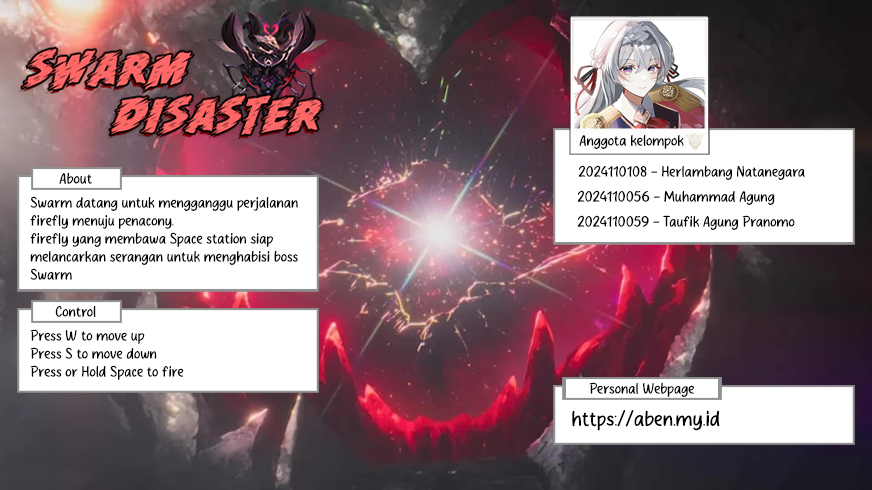

<p align="center">
  
</p>

# 🎮 Swarm Disaster

Sebuah hasil dari remake game 2D yang pernah dibuat sebelumnya di Greenfoot. Desain karakter dan konsep latar diambil dari game berjudul **Honkai: Star rail**.

<br>

## 🔥 Modded

- 🧠 Random enemies movement
- ❤️ Health bar boss
- 🎯 User Interface
- 💥 Sound effect and animation

<br>

## 🛠 Software 

- Greenfoot
- Audition 
- Photoshop 

<br>

## 🚀 Cara Menjalankan

1. Clone repo:
   ```bash
   git clone https://github.com/hybridrev/swarm-disaster.git

2. Jalankan dengan software Greenfoot

<br>

## 📷 Screenshots



---

© 2025 Herlambang Natanegara, Muhammad Agung, & Taufik Agung Pranomo
